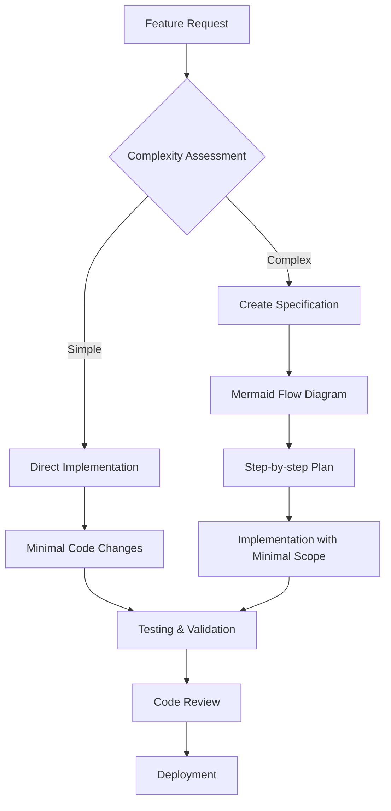
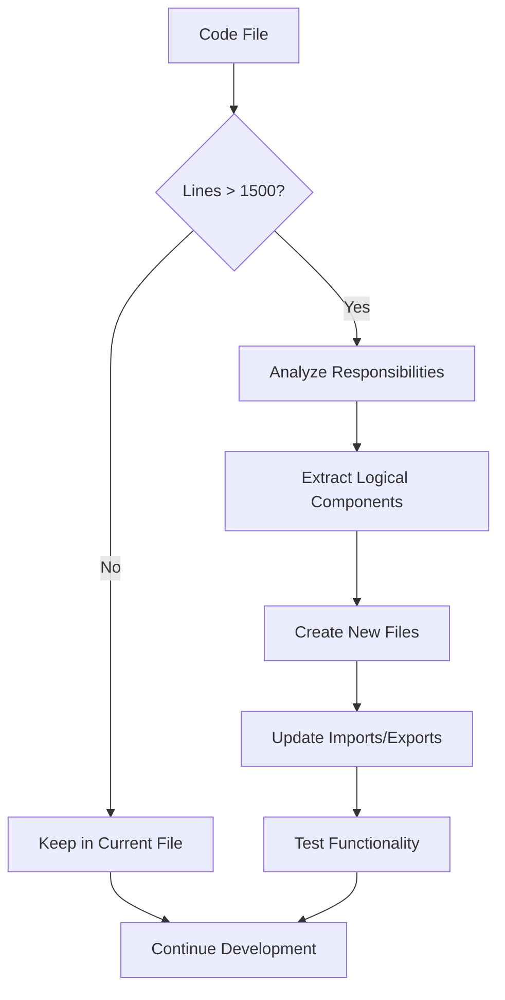

# 🛠️ Development Guidelines

## Core Principles

### Minimal Scope Implementation
Always aim to implement fixes or features with **minimal scope** and apply **minimum edits**.

- ✅ Make the smallest possible change to achieve the desired outcome
- ✅ Avoid unnecessary refactoring when implementing new features
- ✅ Focus on the specific problem or requirement at hand
- ✅ Prefer targeted fixes over broad architectural changes

### Code Organization

#### File Size Management
If a code file exceeds **1,500 lines**, consider creating a new file to maintain the cleanliness of the codebase.

**Guidelines for splitting files:**
- Extract logical components into separate modules
- Group related functions into utility files
- Separate configuration from implementation
- Create dedicated files for constants and types

**Example structure:**
```
src/
├── components/
│   ├── TravelMap.js (main component)
│   ├── MapControls.js (extracted controls)
│   └── PhotoBurst.js (extracted photo effects)
├── utils/
│   ├── dataProcessing.js
│   └── apiHelpers.js
└── config/
    └── constants.js
```

### Complex Features Documentation

#### Specification Requirements
For complicated new features, add instructions with a **Mermaid flow diagram** in the `spec/` folder.

**Required documentation for complex features:**
1. **Purpose and Scope** - What the feature does and why it's needed
2. **Flow Diagram** - Visual representation using Mermaid syntax
3. **Implementation Steps** - Step-by-step breakdown
4. **Dependencies** - Required libraries, APIs, or services
5. **Testing Strategy** - How to verify the feature works

**Example spec file structure:**
```
spec/
├── instagram-auto-update.md
├── travel-map-optimization.md
└── user-authentication.md
```

### Mermaid Diagram Examples

#### Feature Implementation Flow


#### Code Organization Decision Tree


## Implementation Workflow

### 1. Assessment Phase
- Evaluate the scope of the change needed
- Determine if existing files can accommodate the change
- Check if the feature requires specification documentation

### 2. Planning Phase
- If complex: Create specification in `spec/` folder
- If large: Plan file structure and organization
- Identify minimum viable implementation

### 3. Implementation Phase
- Make targeted, minimal changes
- Keep functions focused and single-purpose
- Maintain existing code style and patterns

### 4. Review Phase
- Verify minimal scope was maintained
- Check file sizes and organization
- Ensure documentation is complete

## Examples

### ✅ Good Practice
```javascript
// Minimal fix for image loading issue
function handleImageError(img) {
  img.style.display = 'none';
  img.nextElementSibling?.classList.add('placeholder');
}
```

### ❌ Avoid
```javascript
// Over-engineered solution that refactors entire image system
class ImageManager {
  // 200+ lines of unnecessary abstraction
}
```

### ✅ Good File Organization
```
components/
├── TravelMap.js (800 lines)
├── ImageGallery.js (600 lines)
└── Navigation.js (400 lines)
```

### ❌ Avoid
```
components/
└── App.js (2500 lines - too large!)
```

## Benefits

Following these guidelines ensures:
- 🚀 **Faster development** - Minimal changes mean faster implementation
- 🐛 **Fewer bugs** - Smaller scope reduces risk of unintended consequences
- 📖 **Better maintainability** - Well-organized, documented code is easier to maintain
- 🔄 **Easier reviews** - Focused changes are easier to review and understand
- 🎯 **Clear intent** - Specifications make complex features understandable

---

*Remember: The goal is to solve problems efficiently while maintaining code quality and readability.*
