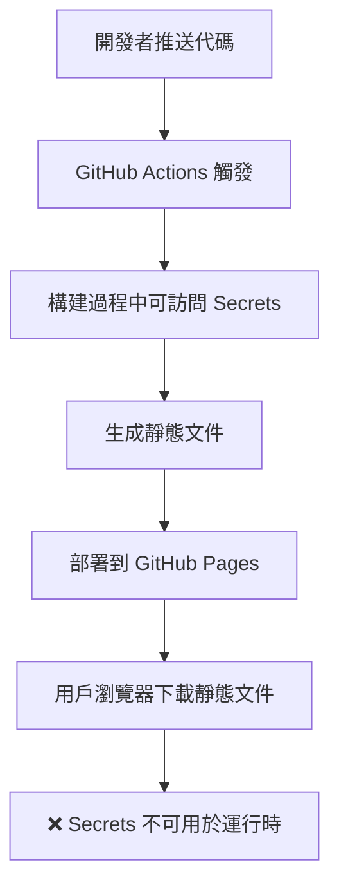

# 🔒 為什麼 GitHub Actions Secrets 不夠安全

## 核心問題：前端 vs 後端安全

### GitHub Actions Secrets 的作用範圍



### 問題詳解

#### 1. **構建時 vs 運行時**
```javascript
// ❌ 這樣做不會起作用
// GitHub Actions 可以在構建時設置環境變量
process.env.INSTAGRAM_CLIENT_SECRET // 在用戶瀏覽器中是 undefined

// ✅ 正確的方式：後端 API
// 在服務器運行時，環境變量可用
const clientSecret = process.env.INSTAGRAM_CLIENT_SECRET; // 在 Netlify Functions 中可用
```

#### 2. **靜態託管的限制**
GitHub Pages 託管的是靜態文件：
- HTML, CSS, JavaScript 文件
- 沒有服務器端處理能力
- 所有代碼都發送到用戶瀏覽器
- 無法保護運行時機密

#### 3. **OAuth 2.0 安全要求**
Instagram OAuth 需要：
1. **授權碼交換** - 必須在服務器端進行
2. **客戶端密鑰** - 絕不能暴露給前端
3. **安全重定向** - 需要驗證來源

## 實際安全風險

### 🚨 當前風險評估

1. **客戶端密鑰暴露**
   ```javascript
   // 在瀏覽器開發者工具中可見
   const clientSecret = "your_secret_here"; // ❌ 任何人都能看到
   ```

2. **令牌劫持**
   - 訪問令牌在網絡請求中暴露
   - localStorage 數據可被腳本讀取
   - 沒有適當的過期處理

3. **CSRF 攻擊**
   - 缺乏 state 參數驗證
   - 沒有來源驗證
   - 重放攻擊風險

## 正確的安全架構

### 🛡️ 三層安全模型

```
┌─────────────────┐    ┌─────────────────┐    ┌─────────────────┐
│   前端 (公開)    │    │   後端 (私密)    │    │ Instagram API   │
├─────────────────┤    ├─────────────────┤    ├─────────────────┤
│ • 客戶端 ID     │────│ • 客戶端密鑰     │────│ • 令牌驗證      │
│ • 重定向 URI    │    │ • 令牌交換       │    │ • 數據訪問      │
│ • 用戶界面      │    │ • 安全驗證       │    │ • 速率限制      │
│ • 授權碼接收    │    │ • 錯誤處理       │    │                 │
└─────────────────┘    └─────────────────┘    └─────────────────┘
      公開可見              服務器端專用           第三方 API
```

### 🔐 環境變量的正確使用

#### 構建時環境變量（GitHub Actions）
```yaml
# .github/workflows/deploy.yml
env:
  PUBLIC_CLIENT_ID: ${{ secrets.INSTAGRAM_CLIENT_ID }}  # ✅ 公開信息
  # 不要在這裡使用 CLIENT_SECRET - 它不會在運行時可用
```

#### 運行時環境變量（Netlify/Vercel）
```javascript
// netlify/functions/token-exchange.js
exports.handler = async (event) => {
    const clientSecret = process.env.INSTAGRAM_CLIENT_SECRET; // ✅ 安全
    // 這個變量只在服務器端可用，用戶無法訪問
};
```

## 實施建議

### 步驟 1：選擇後端解決方案
```bash
# 選項 A: Netlify Functions (推薦)
netlify deploy --functions=netlify/functions

# 選項 B: Vercel API Routes  
vercel deploy

# 選項 C: AWS Lambda
aws lambda create-function --function-name instagram-auth
```

### 步驟 2：安全配置檢核
```bash
# 檢查前端是否還有敏感信息
grep -r "secret\|SECRET" travel-map/ || echo "✅ 前端清潔"

# 驗證環境變量設置
curl -X POST https://your-api.netlify.app/.netlify/functions/instagram-token-exchange \
  -d '{"test": true}' || echo "❌ 需要設置 API 端點"
```

### 步驟 3：測試安全性
1. **開發者工具檢查** - 確保沒有敏感信息暴露
2. **網絡監控** - 驗證 API 調用路由正確
3. **令牌生命週期** - 測試自動清理機制

## 常見誤解澄清

### ❌ 錯誤想法
"我可以用 GitHub Actions Secrets 在構建時創建包含機密的配置文件"

### ✅ 現實情況
即使在構建時創建，該文件仍會部署到靜態託管，用戶仍可訪問

### ❌ 錯誤想法  
"我可以混淆或加密前端的機密信息"

### ✅ 現實情況
任何發送到瀏覽器的信息都可以被逆向工程

## 結論

GitHub Actions Secrets 是構建時工具，不是運行時安全解決方案。對於需要保護敏感信息的 OAuth 流程，**必須使用服務器端環境**。

**記住：如果代碼在瀏覽器中運行，它就是公開的。**
